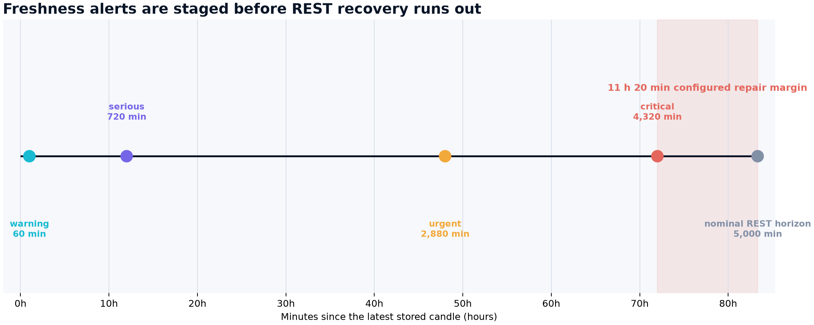
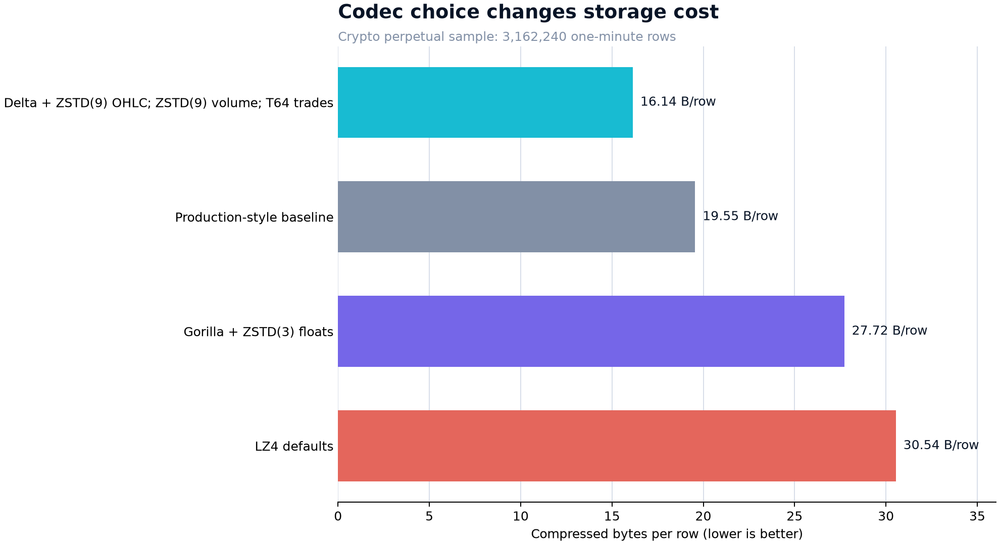

# Building Long-Term Hyperliquid Candle History from a Short REST Window

Hyperliquid's REST application programming interface (API) exposes only a recent slice of one-minute candles. The project documentation uses a working horizon of roughly 5,000 candles, or 3 days, 11 hours, and 20 minutes. Once an outage exceeds that window, a REST collector cannot reconstruct the missing history.

That constraint changes the engineering problem. This is not a one-off downloader. It is a small service that must keep running, know exactly where storage ends for every perpetual contract, tolerate repeated inserts, and repair misses while the source still remembers them.

The resulting pipeline is deliberately narrow: discover active perpetual markets, fetch closed one-minute candles, write them to ClickHouse, and record enough quality information to spot trouble early. It does not trade, stream WebSocket data, ingest a deep archive, or operate the database itself.

## The clock starts at the last closed minute

A candle still forming at request time can change. The collector therefore stops at the latest fully closed candle.

Let $t$ be the current Unix time in milliseconds, let $\Delta=60{,}000$ milliseconds be one minute, and let $t_{\mathrm{closed}}$ be the open time of the latest closed candle. Then:

$$
t_{\mathrm{closed}}
=
\left\lfloor\frac{t}{\Delta}\right\rfloor\Delta-\Delta.
$$

For symbol $s$, let $w_s$ be the latest stored open time, $k$ be the number of overlap candles, and $H$ be the REST horizon measured in one-minute candles. The incremental request begins at:

$$
t_{\mathrm{start},s}
=
\max\left(w_s-k\Delta,\ t_{\mathrm{closed}}-H\Delta\right).
$$

The first term deliberately re-fetches recent rows. The second prevents the service from spending requests on time ranges that REST can no longer return. With the checked-in configuration, $k=5$ and $H=5{,}000$.

## ClickHouse rows are the watermark

There is no local progress file and no separate watermark table. At the start of each cycle, the service queries `max(open_time)` by symbol from ClickHouse. Stored candle rows are the single source of truth.

That choice removes an awkward failure case. If a process writes candles and crashes before updating a separate cursor, the two records disagree. Here, a restart simply reads the rows that actually landed and rebuilds the next request window from them.

The cycle has three passes:

1. New symbols receive an initial backfill, clamped to the recoverable REST window.
2. Existing symbols are fetched from their watermark minus five minutes through the latest closed minute.
3. Internal gaps still inside the REST window are detected and fetched again.

One symbol can fail without cancelling inserts for every other symbol. Writes are also chunked by a configurable row limit, so a full-universe cold start does not become one unbounded in-memory batch.

The core window calculation is short:

```python
horizon_floor_ms = last_closed_ms - rest_horizon_min * interval_ms

for symbol in symbols:
    watermark_ms = watermarks_ms.get(symbol)
    if watermark_ms is None:
        continue

    overlapped_start_ms = watermark_ms - overlap_candles * interval_ms
    start_ms = max(overlapped_start_ms, horizon_floor_ms)
    if start_ms <= last_closed_ms:
        work_items.append(
            WorkItem(symbol=symbol, start_ms=start_ms, end_ms=last_closed_ms)
        )
```

No cursor is trusted merely because the previous process claimed success. Progress is inferred from durable data.

## Why pagination walks backward

The least obvious problem sits in the source API. The repository's live probes found `candleSnapshot` to be newest-anchored: when a requested window is too wide, the response retains candles near `endTime` and silently drops older overflow.

Forward pagination cannot recover that overflow. Repeating a broad request with the same end keeps returning the newest reachable slice. The fetcher instead moves `endTime` backward to one interval before the oldest candle just received:

```python
oldest_open_ms = min(candle.open_time_ms for candle in page)
if oldest_open_ms <= start_ms:
    break

next_cursor_end_ms = oldest_open_ms - interval_ms
if next_cursor_end_ms >= cursor_end_ms:
    break

cursor_end_ms = next_cursor_end_ms
```

The cursor-progress guard matters. If the API ever ignores `endTime`, the loop stops instead of spinning forever. Initial backfill, incremental catch-up, and gap repair all call this same fetch primitive, so pagination behavior cannot drift across paths.

## Overlap is safe, but duplicates are temporarily real

The raw table uses ClickHouse's `ReplacingMergeTree(inserted_at)` engine and sorts by `(symbol, open_time)`. Re-fetching five candles on every cycle is intentional. It covers boundary mistakes, recently revised source values, and crashes near the end of an insert.

Idempotent does not mean physically unique at every instant. ClickHouse removes older versions during background merges, so duplicate keys may coexist before a merge completes. Research queries that need exactly one row per symbol-minute should collapse versions with `argMax(..., inserted_at)`, query with `FINAL`, or apply an equivalent deduplication step.

This is a useful trade: ingestion stays simple and restart-safe, while readers choose whether they need immediate logical uniqueness or maximum scan speed.

## Freshness is a recovery budget

Freshness monitoring is often treated as a dashboard nicety. Here it protects data that will otherwise become permanently unavailable from REST.



The chart uses the checked-in `config.toml`, not observed production downtime. Warning, serious, urgent, and critical thresholds occur at 60, 720, 2,880, and 4,320 minutes. The nominal REST floor is 5,000 minutes, leaving 680 minutes, or 11 hours and 20 minutes, between the critical alert and that configured boundary.

The quality command checks more than lag. It reports active-symbol freshness, duplicate raw keys, gaps, daily row counts, active ClickHouse parts, and recent ingestion runs. Freshness is scoped to the current Hyperliquid universe, which prevents a delisted contract from producing a permanent false alarm while preserving its historical rows.

## Compression was measured, not guessed

Minute bars contain strongly structured columns. Timestamps advance regularly, adjacent prices tend to be close, trade counts are bounded integers, and fractional volume is noisy. A single generic codec is unlikely to suit all four shapes.

Let $B_u$ be uncompressed bytes, $B_c$ be compressed bytes, and $N$ be the row count. Compression ratio $R$ and compressed bytes per row $b$ are:

$$
R=\frac{B_u}{B_c},
\qquad
b=\frac{B_c}{N}.
$$

The schema decision uses $b$, where lower is better. Ratio alone can look attractive simply because the uncompressed type is wider.



These values come from the repository's separate 3,162,240-row crypto perpetual benchmark, not a production measurement of the Hyperliquid table. On that sample, the best lossless mix used Delta plus Zstandard (ZSTD) for open, high, low, and close prices, plain ZSTD for fractional volume, and T64 plus ZSTD for trade counts. It required 16.14 bytes per row versus 19.55 for the production-style baseline, a reduction of about 17.4%. Gorilla plus ZSTD used 27.72 bytes per row, while default LZ4 used 30.54.

The created Hyperliquid schema follows the measured column pattern while choosing ZSTD level 12: `DoubleDelta` for timestamps, `Delta` for prices, plain ZSTD for lossless `Float64` volume, and `T64` for `UInt32` trade counts. The benchmark supports the codec ranking. It does not establish the eventual storage footprint of this specific dataset.

## What the design guarantees, and what it cannot

The service is restart-safe within the source's recoverable window. It recomputes state from stored rows, re-fetches a bounded overlap, isolates per-symbol failures, and attempts to heal recent internal gaps. Those properties are covered by unit tests for time arithmetic, pagination, parsing, work-item construction, gap handling, and chunked writes.

The design cannot recover an outage older than REST history. A nominal 5,000-minute setting is also not a contractual guarantee that every request will expose exactly 5,000 candles. The project notes a live probe near 5,186 candles, but it conservatively operates on 5,000. Deep history still requires another source, such as an archive, or continuous collection before the window expires.

There is one more boundary worth keeping explicit: the repository contains no frozen production quality report. I can explain the failure model, tested behavior, configured thresholds, and measured codec experiment. I cannot honestly claim production uptime, ingest throughput, accumulated row count, or the live table's compression ratio from the material checked into this project.

That restraint is part of building research infrastructure well. A durable market-data pipeline should make its guarantees legible, and its unknowns just as legible.
