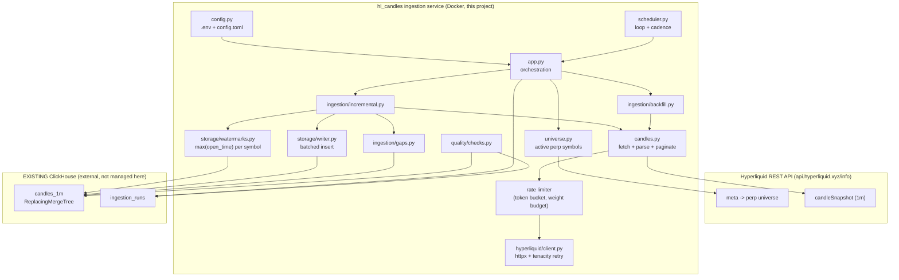

# Hyperliquid 1-Minute Perpetual Candle Ingestion — Implementation Plan

> Status: **PLAN ONLY**. No production code is written yet. This document is the
> contract the next prompt can use to ask for "implement Phase 1".
> Target environment: a single retail VPS, ClickHouse already running and
> external to this project.

---

## 1. Executive Summary

We will build a small, robust Python service (`hl_candles`) that ingests
**Hyperliquid perpetual 1-minute candles** for **all listed perpetual symbols**
into an **existing** ClickHouse database, using the official REST
`candleSnapshot` info endpoint. The service is **restart-safe**: on every run it
derives, per symbol, the latest stored candle from ClickHouse, re-fetches a
small overlap window, and inserts idempotently. Deduplication is handled by a
`ReplacingMergeTree` table keyed on `(symbol, open_time)`, so re-fetching the
same candle never corrupts the database.

The dominant external constraint is the Hyperliquid REST limit: **only the most
recent ~5000 candles per symbol are reachable** (5000 minutes ≈ **3.47 days**
for 1m), under a shared **1200 weight/minute per-IP** budget. Because there is
no batch candle endpoint, we issue one request per symbol and pace them with a
token-bucket rate limiter. These two facts drive every sizing decision below:
the initial backfill can only seed ~3.5 days from REST, and the natural polling
cadence is **every 15 minutes** (hourly is an even safer alternative), not every
minute. The service accumulates true long-term history simply by running
continuously from now forward.

Recommended runtime: a **simple loop inside the ingestion container** with a
Docker `restart: unless-stopped` policy. A `run_once` entrypoint is also
provided so a host `systemd` timer or cron is a drop-in alternative. ClickHouse
is never started, configured, or containerized by this project; we only validate
the connection and create the database/table objects if missing.

### Verified facts this plan is built on

| Fact | Source | Design impact |
|---|---|---|
| `candleSnapshot` req = `{coin, interval, startTime, endTime}` (ms) | HL info-endpoint docs | Fetch contract |
| Intervals include `"1m"` | HL info-endpoint docs | We use `1m` only |
| **Only most recent 5000 candles available** | HL info-endpoint docs | REST horizon ≈ 3.47 days for 1m |
| Time-range responses paginate at 500 elements per block | HL info-endpoint docs | Loop pagination by last `t` |
| REST shared budget **1200 weight/min per IP** | HL rate-limits docs | Pace all per-symbol requests |
| Most `info` requests = weight 20 | HL rate-limits docs | ~60 plain requests/min ceiling |
| `candleSnapshot` adds weight per **60 items** returned | HL rate-limits docs | Big responses cost more |
| Perp coin name comes from `meta` `universe` | HL info-endpoint docs | Symbol discovery via `meta` |
| Your env keys: `IVYDB_CLICKHOUSE_*`, HTTP port 50050, db `hyperliquid` | your `.env` | Connection layer |

> **Assumption to verify empirically in Phase 1**: whether `candleSnapshot`
> returns up to 5000 candles in one response or pages at 500. The plan codes
> defensively (paginate by last returned `t`), so either behavior works.

---

## 2. Ranked Implementation Phases

Phases are ordered so each builds on a working, verifiable predecessor. Each
phase ends with a concrete "done when" check.

### Phase 1 — Foundations: config, connection, schema (MVP core)
1. `uv` project scaffold, dependencies, `config.toml`, `.env` loader.
2. ClickHouse client that reads `IVYDB_CLICKHOUSE_*` from `.env`.
3. **Startup connection validation** (`SELECT 1`, server version).
4. **Idempotent schema creation**: `CREATE DATABASE IF NOT EXISTS` +
   `CREATE TABLE IF NOT EXISTS` for `candles_1m` and `ingestion_runs`.
5. Hyperliquid REST client (`httpx`) with retry/backoff + rate limiter.
6. `meta` fetch → list of active perpetual symbols.
7. A one-symbol probe that fetches and parses 1m candles for `BTC`.

**Done when**: running the probe prints parsed candles for `BTC` and the two
tables exist in ClickHouse, verified by `SHOW TABLES`.

### Phase 2 — Incremental ingestion cycle (the heart of the service)
1. Per-symbol watermark query (`max(open_time)`).
2. Overlap-aware window computation (start = watermark − overlap; end = last
   fully-closed minute).
3. Fetch → parse → accumulate all symbols → **single batched insert** per cycle.
4. Write an `ingestion_runs` metadata row.
5. Graceful shutdown (SIGTERM/SIGINT) and structured logging.

**Done when**: two consecutive runs leave no duplicate `(symbol, open_time)`
rows (verified by the duplicate-key query) and the row count grows only by newly
closed candles.

### Phase 3 — Initial backfill mode
1. For symbols with no rows, fetch the reachable history (~5000 candles).
2. Page by last returned `t` until `endTime` or no progress.
3. Reuse the same batched insert + dedup path.

**Done when**: a fresh symbol is seeded with ~3.5 days of contiguous 1m candles,
confirmed by the gap-check query reporting zero internal gaps.

### Phase 4 — Scheduling & containerization
1. Loop scheduler with fixed cadence + jitter and catch-up-on-startup.
2. `Dockerfile` (service only) + `docker-compose.yml` referencing external
   ClickHouse via `.env`; `restart: unless-stopped`.
3. `run_once` entrypoint for systemd/cron parity.

**Done when**: `docker compose up` runs cycles on schedule; killing the
container and restarting backfills the gap automatically.

### Phase 5 — Data quality & monitoring
1. Quality-check module (latest ts, gaps, duplicates, daily counts).
2. Storage/parts health checks (`system.parts`, compression ratio).
3. `run_quality_report` entrypoint producing a text/HTML summary.

**Done when**: the report runs against the live table and flags any gap or
small-parts problem.

### Phase 6 (optional, later) — Hardening
Alerting hooks, stuck-ingestion watchdog, richer health endpoint. Out of MVP.

---

## 3. Architecture Diagram (Mermaid)



---

## 4. Existing ClickHouse Assumptions

This project treats ClickHouse as a pre-existing, reachable service. We assume:

- ClickHouse is running and reachable at `IVYDB_CLICKHOUSE_HOST:IVYDB_CLICKHOUSE_PORT`
  (your `.env` shows `localhost:50050`, the **HTTP** interface).
- Auth via `IVYDB_CLICKHOUSE_USERNAME` / `IVYDB_CLICKHOUSE_PASSWORD`.
- `IVYDB_CLICKHOUSE_SECURE=false` (plain HTTP); the client honors this flag for
  HTTPS if ever set true.
- Target database `IVYDB_CLICKHOUSE_DATABASE=hyperliquid`.
- The configured user has rights to `CREATE DATABASE`/`CREATE TABLE`/`INSERT`/
  `SELECT` and to read `system.parts` / `system.columns` for quality checks.

**What this project does NOT do**: install, configure, containerize, tune, or
back up ClickHouse; edit `*.xml` server configs; manage users. Only logical
objects (one database, two tables) are created — and only `IF NOT EXISTS`.

Client library: **`clickhouse-connect`** (official, HTTP-native, matches port
50050; supports efficient columnar batch inserts).

Startup validation sequence:
1. Open client from `.env` values.
2. `SELECT 1` (connectivity) and `SELECT version()` (log it).
3. `CREATE DATABASE IF NOT EXISTS hyperliquid`.
4. Run table DDL (`IF NOT EXISTS`).
5. Abort with a clear error if any step fails (do not silently continue).

---

## 5. ClickHouse Schema Plan

### 5.1 Candle field mapping (Hyperliquid → table)

`candleSnapshot` returns objects with these keys (prices/volume are JSON
strings; convert to numeric on parse):

| HL key | Meaning | Column | Type |
|---|---|---|---|
| `t` | open time (ms) | `open_time` | `DateTime64(3,'UTC')` |
| `T` | close time (ms) | `close_time` | `DateTime64(3,'UTC')` |
| `s` | symbol | `symbol` | `LowCardinality(String)` |
| `i` | interval | (not stored; always `1m`) | — |
| `o` | open | `open` | `Float64` |
| `c` | close | `close` | `Float64` |
| `h` | high | `high` | `Float64` |
| `l` | low | `low` | `Float64` |
| `v` | base volume | `volume` | `Float64` |
| `n` | trade count | `trades` | `UInt32` |
| — | ingest time (version) | `inserted_at` | `DateTime64(3,'UTC')` DEFAULT `now64(3)` |

### 5.2 Table: `candles_1m`

```sql
CREATE TABLE IF NOT EXISTS hyperliquid.candles_1m
(
    symbol      LowCardinality(String),
    open_time   DateTime64(3, 'UTC')  CODEC(DoubleDelta, ZSTD(3)),
    close_time  DateTime64(3, 'UTC')  CODEC(DoubleDelta, ZSTD(3)),
    open        Float64               CODEC(Gorilla, ZSTD(3)),
    high        Float64               CODEC(Gorilla, ZSTD(3)),
    low         Float64               CODEC(Gorilla, ZSTD(3)),
    close       Float64               CODEC(Gorilla, ZSTD(3)),
    volume      Float64               CODEC(Gorilla, ZSTD(3)),
    trades      UInt32                CODEC(T64, ZSTD(3)),
    inserted_at DateTime64(3, 'UTC')  DEFAULT now64(3) CODEC(DoubleDelta, ZSTD(3))
)
ENGINE = ReplacingMergeTree(inserted_at)
PARTITION BY toYYYYMM(open_time)
ORDER BY (symbol, open_time)
SETTINGS index_granularity = 8192;
```

**Justifications**

- **Engine — `ReplacingMergeTree(inserted_at)`**: gives idempotency for free.
  Rows sharing the `ORDER BY` key `(symbol, open_time)` are collapsed at merge
  time; the row with the largest `inserted_at` wins, which correctly handles
  Hyperliquid *revising* a recently closed candle. Re-fetching overlap can never
  permanently duplicate or corrupt a candle.
- **Partitioning — `toYYYYMM(open_time)`**: monthly partitions. With ~200
  symbols × ~43,200 minutes/month ≈ 8.6M rows/month, monthly parts are large
  enough to compress well and few enough to avoid the "too many partitions"
  anti-pattern. Daily partitioning would create excessive small partitions; this
  is the classic market-data choice.
- **Ordering — `(symbol, open_time)`**: matches the dominant query pattern
  ("give me one symbol's candles over a time range"). Sorting by symbol first
  clusters each instrument contiguously, which maximizes codec effectiveness on
  the time and price columns.
- **Codecs**:
  - `DoubleDelta + ZSTD` on the timestamps: minute series are an arithmetic
    progression (+60000 ms), which `DoubleDelta` reduces to near-zero residuals.
  - `Gorilla + ZSTD` on prices/volume: Gorilla XOR-encodes successive floats and
    excels on slowly varying numeric series (Facsimile of the Facebook Gorilla
    TSDB scheme). Adjacent 1m OHLCV values change little, so this is ideal.
  - `T64 + ZSTD` on `trades` (small integers): bit-packs the range.
- **Deduplication strategy**: physical dedup via ReplacingMergeTree at merge;
  logical dedup at read time via `FINAL` or `argMax` (see §8) so queries are
  correct *before* a merge runs.
- **Query patterns supported**: single-symbol range scans (fast, ordered),
  multi-symbol day aggregates, `max(open_time)` watermark lookups (reads the tail
  of each symbol's range), and gap scans via window functions.
- **Compression reasoning**: time-ordered inserts + symbol clustering + the codec
  stack typically yield very high compression on OHLCV (often 5–15x); see §7.

### 5.3 Table: `ingestion_runs` (recovery / monitoring metadata)

```sql
CREATE TABLE IF NOT EXISTS hyperliquid.ingestion_runs
(
    run_id            UUID,
    mode              Enum8('initial' = 1, 'incremental' = 2),
    started_at        DateTime64(3, 'UTC'),
    finished_at       Nullable(DateTime64(3, 'UTC')),
    symbols_total     UInt32,
    symbols_ok        UInt32,
    symbols_failed    UInt32,
    candles_inserted  UInt64,
    status            Enum8('success' = 1, 'partial' = 2, 'failed' = 3),
    error             String DEFAULT ''
)
ENGINE = MergeTree
PARTITION BY toYYYYMM(started_at)
ORDER BY (started_at);
```

**Justification**: append-only audit log of cycles. Plain `MergeTree` (no dedup
needed). Enables "is ingestion stuck?", "last successful run", and per-run
throughput metrics. Cheap and small.

### 5.4 Why no separate watermark table

The latest stored candle per symbol is derivable directly:
`SELECT symbol, max(open_time) FROM candles_1m GROUP BY symbol`. A dedicated
watermark table would be a second source of truth that can drift from reality
after a crash mid-insert. We keep `candles_1m` as the single source of truth.
(If watermark queries ever become slow at scale, revisit with a
`SimpleAggregateFunction(max,...)` materialized view — not needed for MVP.)

---

## 6. Backfill & Restart-Recovery Algorithm

### 6.1 Core constants (tunable in `config.toml`)

```
interval_ms        = 60_000          # 1 minute
overlap_candles    = 5               # re-fetch last 5 closed candles each cycle
rest_horizon_min   = 5000            # HL hard limit (~3.47 days for 1m)
page_limit         = 5000            # assume up to 5000/req; paginate defensively
poll_interval_sec  = 900             # 15 minutes (see scheduling, can be 3600)
weight_budget_pm   = 900             # stay under HL 1200/min with headroom
```

### 6.2 Restart-safe principle

Nothing depends on a timer having kept running. On **every** cycle the service
reconstructs state from ClickHouse. If the process, container, or ClickHouse
restarted, the next cycle simply observes an older watermark and backfills the
gap — provided the gap is within the ~3.47-day REST horizon.

### 6.3 "Last safely closed minute"

Only ingest candles whose minute has fully closed to avoid storing a partial,
still-mutating candle:

```
now_ms              = current epoch ms
last_closed_open_ms = floor(now_ms / 60000) * 60000 - 60000
```

We never request an `endTime` past `last_closed_open_ms + 59_999`.

### 6.4 Incremental backfill (per cycle) — pseudocode

```text
function run_incremental_cycle(symbols, ch, hl):
    run = start_run(mode="incremental", symbols_total=len(symbols))
    batch = []                      # accumulate ALL symbols, insert once

    watermarks = ch.query_max_open_time_by_symbol()   # {symbol -> ms or None}
    last_closed = floor(now_ms/60000)*60000 - 60000

    for symbol in symbols:
        wm = watermarks.get(symbol)
        if wm is None:
            continue                # no history -> handled by initial backfill
        start_ms = wm - overlap_candles * interval_ms     # overlap window
        # clamp start to REST horizon so we never request unreachable history
        horizon_floor = last_closed - rest_horizon_min * interval_ms
        start_ms = max(start_ms, horizon_floor)
        if start_ms > last_closed:
            continue                # already current

        candles = hl.fetch_candles(symbol, "1m", start_ms, last_closed)
        batch.extend(parse(candles))
        run.symbols_ok += 1

    if batch:
        ch.insert("candles_1m", batch)     # single batched, idempotent insert
        run.candles_inserted = len(batch)
    finish_run(run, status="success")
```

### 6.5 Initial backfill (per new symbol) — pseudocode

```text
function run_initial_backfill(symbol, ch, hl):
    last_closed = floor(now_ms/60000)*60000 - 60000
    start_ms    = last_closed - rest_horizon_min * interval_ms   # ~3.47 days ago
    cursor      = start_ms
    batch       = []

    while cursor <= last_closed:
        candles = hl.fetch_candles(symbol, "1m", cursor, last_closed)
        if not candles:
            break
        batch.extend(parse(candles))
        newest_t = max(c.t for c in candles)
        if newest_t <= cursor:          # no forward progress -> stop
            break
        cursor = newest_t + interval_ms # page forward by last returned open time
        if len(candles) < page_limit:   # last page reached
            break

    if batch:
        ch.insert("candles_1m", dedupe_by_open_time(batch))
```

`dedupe_by_open_time` is a cheap in-memory guard against page-boundary overlap;
ClickHouse still provides the durable dedup.

### 6.6 Gap-check algorithm (practical)

Two complementary checks. **Detection** uses a window function; **repair** reuses
initial/incremental backfill for any gap inside the REST horizon.

Per-symbol gap detection (returns the start of each missing run):
```sql
SELECT
    symbol,
    prev_open                                   AS gap_after,
    open_time                                   AS gap_before,
    (toUnixTimestamp64Milli(open_time)
      - toUnixTimestamp64Milli(prev_open)) / 60000 - 1 AS missing_minutes
FROM
(
    SELECT
        symbol,
        open_time,
        lagInFrame(open_time) OVER
            (PARTITION BY symbol ORDER BY open_time) AS prev_open
    FROM hyperliquid.candles_1m FINAL
)
WHERE prev_open != toDateTime64(0, 3)
  AND (toUnixTimestamp64Milli(open_time)
        - toUnixTimestamp64Milli(prev_open)) > 60000
ORDER BY symbol, gap_after;
```

Repair policy: for each detected gap whose `gap_after` is newer than the REST
horizon floor, re-run a bounded fetch for `[gap_after, gap_before]`. Gaps older
than the horizon are **unrecoverable via REST** and only logged (would require
the historical S3 archive — out of scope; see §11).

> Per the AGENTS guidance not to over-engineer for multi-day outages: routine
> downtime is short, so the standard incremental overlap window covers it. The
> explicit gap scan is a periodic safety net (run in the quality job), not part
> of the hot path.

---

## 7. Compression Strategy

**Does periodic ingestion for many symbols hurt compression?**
No — *if inserts are batched*. Compression quality depends on how well data
sorts within a part and on codec fit, not on whether ingestion is periodic. We
insert in time order into an `ORDER BY (symbol, open_time)` table, so each part
is internally well-sorted and the `DoubleDelta`/`Gorilla` codecs work near their
best case.

**Does ClickHouse rewrite old data when new data is inserted?**
No. ClickHouse is append-structured. Every `INSERT` creates a **new immutable
part**. Existing parts are never modified by an insert. Old data is only ever
rewritten asynchronously by **background merges**, which combine several parts
into a larger one (re-applying codecs + ZSTD on the merged, still-sorted data,
usually improving the ratio).

**How parts and merges affect this design.**
- Many tiny inserts → many small parts → merge pressure, more open file handles,
  temporarily worse compression, and risk of the "too many parts" error.
- Therefore: **one batched insert per cycle**, not one per symbol per minute.
- Let ClickHouse's default background merge scheduler do the consolidation; do
  not force `OPTIMIZE ... FINAL` on a schedule (expensive, rewrites everything).

**Recommended insert policy.**
- All Hyperliquid perp symbols, 1m candles.
- Poll every **15 minutes** (default; **hourly** is an even lighter, equally
  valid choice for a research store).
- Accumulate every symbol's new candles in memory, then perform **a single
  columnar batch insert per cycle**.
  - 15-min cadence, ~200 symbols × ~15–20 candles ≈ **3,000–4,000 rows/insert**,
    **96 inserts/day**.
  - Hourly cadence ≈ 12,000 rows/insert, 24 inserts/day (fewer, larger parts).
- This yields large, well-sorted parts and a healthy part count; merges keep the
  on-disk footprint compact over time.

**Future expansion (more symbols / larger data types).**
The batched-insert pattern scales: more symbols just means more rows per cycle,
still one insert. If later adding trades/L2 (out of scope now), give each its own
table with its own engine/partitioning rather than widening `candles_1m`.

---

## 8. Idempotency & Duplicate Handling

- **Write-side idempotency**: deterministic key `(symbol, open_time)` +
  `ReplacingMergeTree(inserted_at)`. Re-fetching overlap re-inserts identical
  keys; merges collapse them, keeping the freshest by `inserted_at`.
- **Closed-candle guard**: never insert the in-progress minute (§6.3), so we
  don't persist a value that will change next cycle.
- **Read-side correctness before merges run**: merges are asynchronous, so
  duplicates can exist transiently. Queries must dedup explicitly. Two options:
  - Small/ad-hoc: `SELECT ... FROM candles_1m FINAL WHERE symbol = ...`.
  - Large/aggregations (preferred, avoids `FINAL` cost): collapse with `argMax`:
    ```sql
    SELECT
        symbol,
        open_time,
        argMax(open,   inserted_at) AS open,
        argMax(high,   inserted_at) AS high,
        argMax(low,    inserted_at) AS low,
        argMax(close,  inserted_at) AS close,
        argMax(volume, inserted_at) AS volume,
        argMax(trades, inserted_at) AS trades
    FROM hyperliquid.candles_1m
    WHERE symbol = {sym:String}
      AND open_time BETWEEN {start:DateTime64(3)} AND {end:DateTime64(3)}
    GROUP BY symbol, open_time
    ORDER BY open_time;
    ```
  We will ship a canonical **read view** wrapping this so research queries cannot
  accidentally double-count:
    ```sql
    CREATE VIEW IF NOT EXISTS hyperliquid.candles_1m_clean AS
    SELECT symbol, open_time,
           argMax(open,inserted_at)  AS open,
           argMax(high,inserted_at)  AS high,
           argMax(low,inserted_at)   AS low,
           argMax(close,inserted_at) AS close,
           argMax(volume,inserted_at) AS volume,
           argMax(trades,inserted_at) AS trades,
           max(close_time)           AS close_time
    FROM hyperliquid.candles_1m
    GROUP BY symbol, open_time;
    ```
- **Duplicate-key validation query** (should normally return zero rows once
  merges settle; transient nonzero is acceptable):
    ```sql
    SELECT symbol, open_time, count() AS c
    FROM hyperliquid.candles_1m
    GROUP BY symbol, open_time
    HAVING c > 1
    ORDER BY c DESC
    LIMIT 50;
    ```

---

## 9. Ingestion Scheduling Plan

**Recommended cadence: every 15 minutes** (default), with **hourly** as an
explicitly supported lighter option. Rationale: this is a research/backtesting
store, not a live engine; freshness within 15–60 minutes is ample. Both cadences
sit comfortably inside the REST horizon (~3.47 days) and the 1200 weight/min
budget, and both keep ClickHouse part counts healthy. Per-minute polling is
explicitly rejected (tiny parts, no research benefit).

**Rate-budget sanity check (15-min cadence, ~200 symbols).**
No batch candle endpoint ⇒ ~200 requests/cycle. Each `candleSnapshot` costs
`20 + floor(items/60)` weight; small incremental responses ≈ 20 each ⇒ ~4,000
weight/cycle. At a 1200 weight/min ceiling this needs ≥ ~3.4 min if run flat-out.
We therefore **pace requests with a token-bucket limiter** targeting ≤ ~900
weight/min (headroom), spreading the cycle over ~4–5 minutes — well within a
15-minute window. Hourly cadence has even more slack.

**Option comparison & ranking for a single retail VPS.**

| Rank | Option | Pros | Cons | Verdict |
|---|---|---|---|---|
| **1** | **Loop inside container + Docker `restart: unless-stopped`** | Self-contained; one artifact; in-process rate limiter & graceful shutdown; auto-restart on crash/reboot; easy logging | Long-running process to supervise | **Recommended** |
| 2 | **systemd timer on host → `run_once`** | OS-grade scheduling/restart; no long-lived process; clean logs via journald | Requires host access; ties ingestion to host, not container | Strong alternative; ship `run_once` to enable it |
| 3 | Cron → `run_once` | Ubiquitous, trivial | Poor overlap handling, weak logging, no backoff between failed runs | Acceptable fallback |
| 4 | External orchestrator (k8s, Airflow) | Powerful | Massive overkill for one VPS | Rejected (out of scope) |

We implement **#1 as primary** and provide a **`run_once` entrypoint** so #2/#3
are drop-in without code changes. The loop scheduler: computes next fire time,
sleeps, adds small random jitter (avoid synchronized API bursts), and on startup
immediately runs one catch-up cycle (restart recovery).

---

## 10. Data Quality & Monitoring

Concrete checks (shipped in `quality/checks.py`, surfaced by
`run_quality_report`).

1. **Latest timestamp by symbol** (freshness / stalls):
    ```sql
    SELECT symbol,
           max(open_time) AS last_candle,
           dateDiff('minute', max(open_time), now64(3)) AS minutes_behind
    FROM hyperliquid.candles_1m
    GROUP BY symbol
    ORDER BY minutes_behind DESC;
    ```
2. **Missing 1m candles** — the window-function gap scan in §6.6.
3. **Duplicate candle keys** — the `HAVING count() > 1` query in §8.
4. **Row counts by day & symbol** (coverage / anomalies):
    ```sql
    SELECT toDate(open_time) AS d, symbol, count() AS rows
    FROM hyperliquid.candles_1m
    GROUP BY d, symbol
    ORDER BY d DESC, symbol
    LIMIT 500;       -- expect ~1440 rows/symbol/full day
    ```
5. **Compression & storage efficiency**:
    ```sql
    SELECT
        sum(rows)                                   AS rows,
        formatReadableSize(sum(data_compressed_bytes))   AS compressed,
        formatReadableSize(sum(data_uncompressed_bytes)) AS uncompressed,
        round(sum(data_uncompressed_bytes)
              / sum(data_compressed_bytes), 2)      AS ratio
    FROM system.parts
    WHERE database = 'hyperliquid' AND table = 'candles_1m' AND active;
    ```
6. **Too many small parts / ingestion health**:
    ```sql
    SELECT partition, count() AS parts,
           formatReadableSize(sum(bytes_on_disk)) AS size
    FROM system.parts
    WHERE database='hyperliquid' AND table='candles_1m' AND active
    GROUP BY partition
    ORDER BY parts DESC;      -- many parts in recent partition => insert too often
    ```
7. **Stuck ingestion** (from metadata): last `ingestion_runs` row older than
   `2 × poll_interval`, or `status='failed'` on the latest run.

**Reliability features built into the service (see §2 phases):**
- **Logging**: structured (stdlib `logging` + JSON-ish formatter), one log file
  per run named `YYYY-MM-DD_NNN.log`, errors also to a separate error log; INFO
  for cycle summaries, DEBUG for per-symbol detail.
- **Retry with exponential backoff**: `tenacity` on transient HTTP/network
  errors and HTTP 429/5xx, with jitter and a capped number of attempts.
- **Rate-limit handling**: token-bucket weight limiter (§9) + respect 429 by
  backing off; never burst above the configured weight/min.
- **Graceful shutdown**: trap SIGTERM/SIGINT; finish the in-flight insert, write
  the `ingestion_runs` row, close the client, then exit (clean Docker stop).
- **Health checks**: Docker `HEALTHCHECK` that asserts the last successful
  `ingestion_runs` row is recent; a lightweight liveness file/timestamp.
- **Detecting stuck ingestion**: watchdog query (#7) in the quality job.
- **Data quality checks**: the seven checks above.
- **Alerting (later, out of MVP)**: a thin notifier interface (log → optional
  webhook/email) so Phase 6 can wire alerts without refactoring.

---

## 11. Proposed Project Structure

`uv`-managed, `src` layout, responsibilities split by domain. Names chosen to be
self-explanatory (no vague `utils/`).

```text
hyperliquid-long-term/
├── README.md                     # goal, scope, how to run
├── pyproject.toml                # deps + [project.scripts] entrypoints
├── uv.lock
├── config.toml                   # all tunables, each commented
├── .env / .env.example           # ClickHouse connection (existing keys)
├── Dockerfile                    # service image ONLY (no ClickHouse)
├── docker-compose.yml            # runs service; ClickHouse referenced as external
├── .dockerignore
├── docs/
│   ├── reference/
│   │   └── IMPLEMENTATION_PLAN.md  # this file
│   └── user/                       # run instructions (later)
├── src/
│   └── hl_candles/
│       ├── __init__.py
│       ├── config.py             # load .env + config.toml -> typed Settings
│       ├── logging_setup.py      # log files YYYY-MM-DD_NNN.log + error log
│       ├── app.py                # orchestration: validate -> schema -> cycle
│       ├── scheduler.py          # loop cadence + jitter + catch-up + signals
│       ├── ratelimit.py          # token-bucket weight limiter
│       ├── hyperliquid/
│       │   ├── __init__.py
│       │   ├── client.py         # httpx POST /info, tenacity retry, 429 handling
│       │   ├── universe.py       # meta -> active perp symbol list
│       │   └── candles.py        # candleSnapshot fetch + parse + paginate
│       ├── storage/
│       │   ├── __init__.py
│       │   ├── clickhouse_client.py  # connect from .env, SELECT 1, version
│       │   ├── schema.py         # DDL strings + create-if-not-exists
│       │   ├── writer.py         # batched columnar insert
│       │   └── watermarks.py     # max(open_time) per symbol
│       ├── ingestion/
│       │   ├── __init__.py
│       │   ├── incremental.py    # per-cycle incremental backfill
│       │   ├── backfill.py       # initial backfill for new symbols
│       │   └── gaps.py           # gap detection + bounded repair
│       └── quality/
│           ├── __init__.py
│           └── checks.py         # the §10 SQL checks + report builder
├── scripts/
│   ├── run_once.py               # one cycle (systemd/cron entrypoint)
│   └── run_quality_report.py     # ad-hoc quality report
└── tests/
    ├── unit/                     # parsing, window math, gap logic (no network)
    └── integration/             # against a throwaway db/table (optional)
```

**Entrypoints (`pyproject.toml [project.scripts]`):**
- `hl-ingest = "hl_candles.app:main"` — long-running loop (Docker default CMD).
- `hl-run-once = "hl_candles.scripts_run_once:main"` (or via `scripts/`).
- `hl-quality = "hl_candles.quality.checks:main"`.

**Dependencies (minimal, pinned via uv):**
`clickhouse-connect` (ClickHouse HTTP client), `httpx` (REST), `tenacity`
(retry/backoff), `python-dotenv` (load `.env`). `tomllib` is stdlib (3.13).
Dev: `ruff` (already present), `pytest`.

**`config.toml` tunables (each commented):** `poll_interval_sec`,
`overlap_candles`, `rest_horizon_min`, `weight_budget_per_min`,
`request_timeout_sec`, `max_retries`, `symbols_mode` (`"all"` | explicit list),
`batch_insert_max_rows`, `log_level`.

**Symbol selection**: default `symbols_mode = "all"` (every active perp from
`meta`), with an optional explicit allow-list for testing/cost control. We
recommend "all" per the project goal; the override exists only as an escape
hatch.

---

## 12. Risks & Trade-offs

| Risk | Likelihood | Impact | Mitigation |
|---|---|---|---|
| **REST 5000-candle horizon** (~3.47 days) limits both initial seed and recovery | Certain | Med | Run continuously to accumulate; alert if downtime approaches horizon; deep history via S3 archive is a separate future project |
| Pagination behavior (5000 vs 500/req) unconfirmed | Med | Low | Code paginates by last `t` defensively; verify in Phase 1 probe |
| Candle field keys differ from assumed `t,T,s,i,o,c,h,l,v,n` | Low | Med | Phase 1 probe prints raw JSON; parser adapts before building further |
| ~200 per-symbol requests/cycle vs 1200 weight/min | Med | Med | Token-bucket limiter, ≤900 weight/min, cycle spread over minutes; 15-min/hourly cadence |
| Symbol count grows / new listings mid-run | Med | Low | Re-fetch `meta` each cycle; new symbols seeded by initial backfill |
| Delisted symbols stop returning data | Med | Low | Treat empty responses as no-op; optionally skip flagged delisted from `meta` |
| Transient duplicates before merges run | Certain | Low | Always read via `candles_1m_clean` view / `argMax` / `FINAL` |
| `Float64` vs exact `Decimal` for prices | Low | Low | Float64 is standard for research and compresses well; revisit with `Decimal64` only if exact tick math is later required |
| ClickHouse user lacks `CREATE`/`system` rights | Low | High | Validate on startup; fail fast with a clear message |
| Clock skew on VPS misjudges "last closed minute" | Low | Low | Use overlap window; optionally trust server-returned `T` |

---

## 13. Out of Scope (Do NOT Build Yet)

- No ClickHouse server setup, config, container, tuning, or backup.
- No live trading, order execution, or strategy logic.
- No private wallet/account state, fills, or order status.
- No trades table, BBO table, or L2 order-book archive.
- No higher-timeframe candles (derive later from stored 1m).
- No WebSocket ingestion (REST `candleSnapshot` only for now).
- No deep historical backfill beyond the REST horizon (no S3 archive ingestion).
- No Kubernetes / Airflow / heavy orchestration.
- No premature optimization (no materialized views, sharding, or tiered storage
  until a measured need appears).

---

## 14. Final Recommended MVP Scope

The MVP = **Phases 1–4**:

1. Config + `.env` ClickHouse connection with startup validation.
2. Idempotent creation of `candles_1m` (ReplacingMergeTree) + `ingestion_runs`
   + `candles_1m_clean` read view.
3. Symbol discovery from `meta` (all active perps).
4. Rate-limited, retrying REST client for `candleSnapshot` 1m.
5. Restart-safe incremental cycle: per-symbol watermark → overlap window →
   batched idempotent insert → run metadata.
6. Initial backfill (~3.5 days) for new symbols.
7. Loop scheduler at **15-minute** cadence (config-switchable to hourly) with
   graceful shutdown.
8. Dockerfile + compose (service only) with `restart: unless-stopped`;
   `run_once` entrypoint for systemd/cron parity.

Phase 5 (quality/monitoring report) is strongly recommended immediately after,
and Phase 6 (alerting/watchdog hardening) is deferred until the MVP has run in
production for a while.

**This plan is concrete enough that the next prompt can be: "implement Phase 1."**
